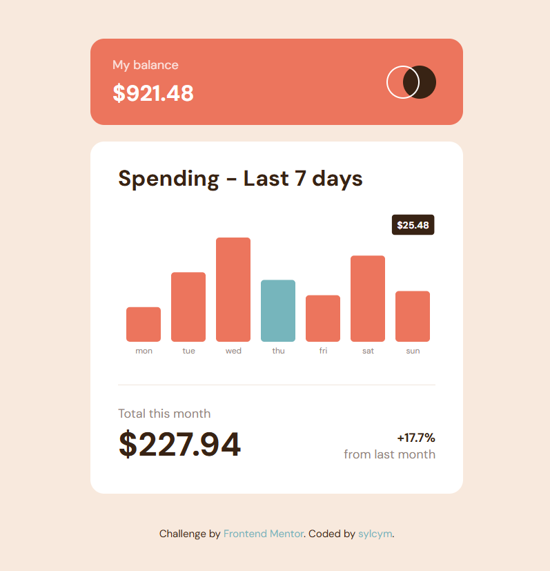

# 💸 Expenses Chart App

A responsive expenses chart built with React and Recharts, based on a Frontend Mentor challenge.

## 🚀 Live Demo

👉 https://sylcym-expenses-chart-react.netlify.app/

## 📸 Preview



## 🛠️ Built with

- React (Vite)
- Recharts
- CSS Modules
- Mobile-first workflow

## ✨ Features

- Interactive bar chart
- Custom tooltip (fully controlled, no Recharts default)
- Highlight current day (cyan color)
- Dynamic calculations:
  - total monthly spending
  - percentage change

- Smooth hover effects & micro-interactions
- Fully responsive layout

## 🧠 What I learned

- How to customize Recharts beyond default behavior
- Managing UI state for interactive charts
- Handling tricky SVG behaviors (tooltip, overlays, cursor issues)
- Structuring scalable React components

## ⚙️ Setup

```bash
npm install
npm run dev
```

## 📦 Build

```bash
npm run build
```

## 📚 Source

Challenge from Frontend Mentor

---

## 👩‍💻 Author

GitHub: [https://github.com/sylcym]
