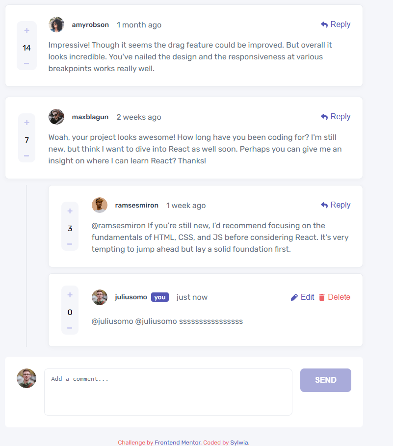

# Interactive Comments Section

A fully functional interactive comments section built with React.

## 🚀 Features

- Add new comments
- Reply to comments (nested replies)
- Edit and delete comments
- Score system (upvote / downvote)
- Persistent data using localStorage
- Responsive layout (mobile & desktop)
- Accessible interactions (focus states, disabled buttons)

## 🛠️ Built with

- React
- CSS (Flexbox & Grid)
- JavaScript (ES6+)

## 📸 Screenshot

## 🔗 Live Demo

## 📚 What I learned

- Building recursive components in React
- Managing complex state (nested data)
- Component refactoring and structure
- Creating reusable UI components
- Handling UI/UX edge cases

## 👩‍💻 Author

- GitHub: [https://github.com/sylcym]
