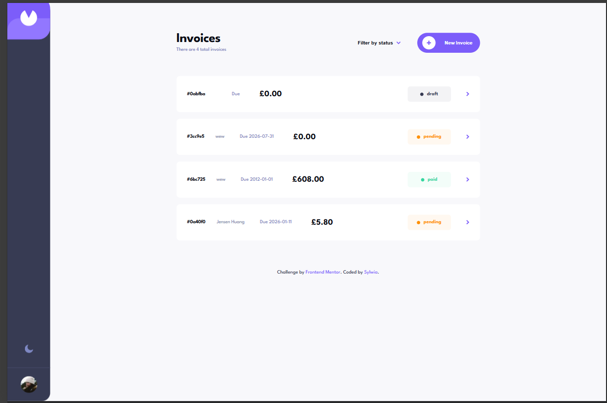
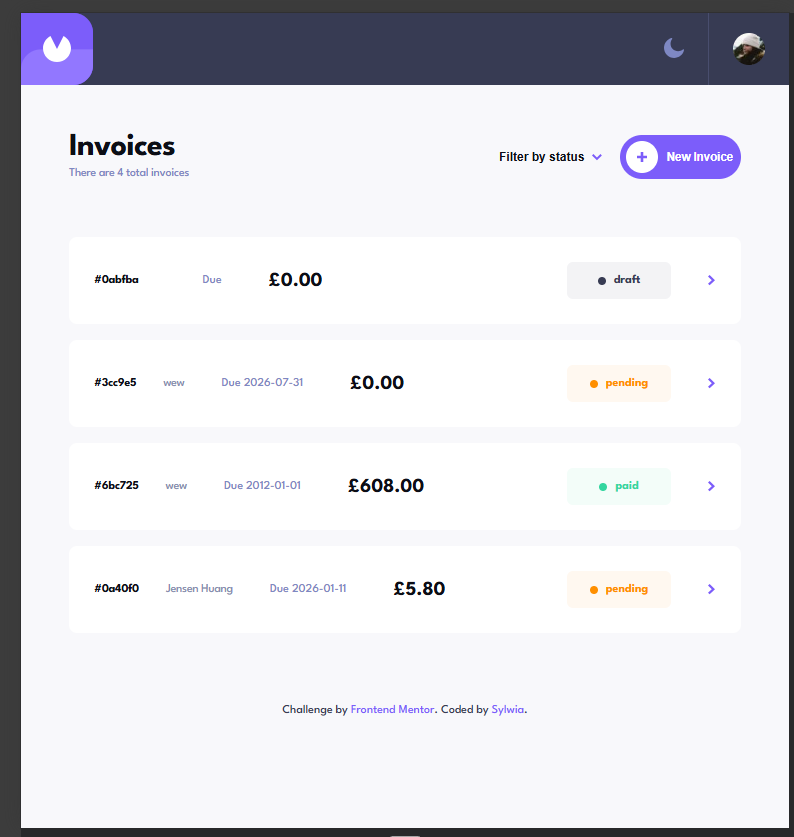
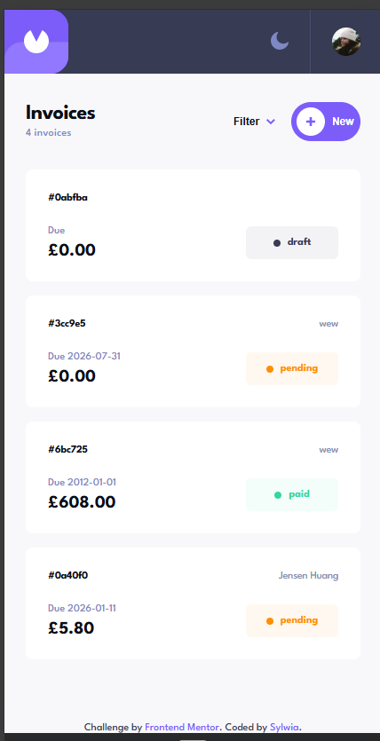

# Invoice App

A fully responsive invoice management application built with React and Vite.

The application allows users to create, edit, delete, filter, and manage invoices while providing a responsive interface, Dark Mode support, Local Storage persistence, and accessible form controls.

---

## 📑 Table of Contents

- [Overview](#-overview)
- [Features](#-features)
- [Built With](#-built-with)
- [Screenshots](#-screenshots)
- [Live Demo](#-live-demo)
- [What I Learned](#-what-i-learned)
- [Possible Enhancements](#-possible-enhancements)
- [Author](#-author)

---

## 📖 Overview

This project is a solution to the **Frontend Mentor Invoice App Challenge**.

The main goal was to build a modern invoice management application while practicing React, component architecture, responsive layouts, state management, accessibility, and user experience.

---

## ✨ Features

- Create new invoices
- Edit existing invoices
- Delete invoices
- Mark invoices as paid
- Save invoices as draft
- Filter invoices by status
- Form validation with visual error states
- Persistent invoice storage using Local Storage
- Dark / Light mode
- Persistent theme preference
- Fully responsive design (mobile-first)
- Accessible form controls
- Reusable React components

---

## 🛠 Built With

- React
- JavaScript (ES6+)
- Vite
- CSS3
- CSS Variables
- Flexbox
- CSS Grid
- Local Storage API

---

## 📸 Screenshots

### Desktop

### Tablet

### Mobile

---

## 🚀 Live Demo

- **Live Site:** https://sylcym-invoice-app.netlify.app/
- **Repository:** https://github.com/sylcym/frontend-mentor-challenges/tree/main/invoice-app

---

## 📚 What I Learned

During this project I improved my skills in:

- Building reusable React components
- Managing complex application state with React Hooks
- Implementing CRUD functionality
- Working with Local Storage
- Form validation and error handling
- Creating responsive layouts using Flexbox and CSS Grid
- Implementing Dark Mode using CSS Variables
- Improving accessibility with semantic HTML, labels, and proper button types
- Organizing a larger React project into reusable components

---

## 💡 Possible Enhancements

Some ideas for future improvements:

- Keyboard shortcuts (Escape to close dialogs)
- Search invoices
- Sorting invoices
- Animations and transitions
- Backend integration
- User authentication

---

## 👤 Author

**GitHub:** Sylwia
