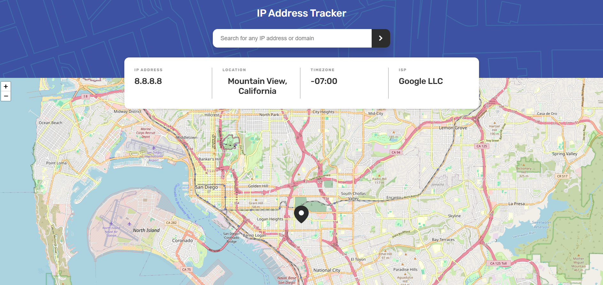

# IP Address Tracker

This is a solution to the [IP Address Tracker](https://www.frontendmentor.io/challenges/ip-address-tracker-I9-0sV1Ob) challenge on [Frontend Mentor](https://www.frontendmentor.io/).

## Overview

### Live Demo

[View Live Site](#)

### Screenshot

### The Challenge

Users should be able to:

- View the optimal layout for the site depending on their device's screen size
- See their own IP address on the map on the initial load
- Search for any IP addresses or domains and see the key information and location
- View the location on an interactive map

### Built With

- React
- JavaScript
- CSS
- Leaflet
- React Leaflet
- IP Geolocation API

### Responsive Design

The layout was created using a mobile-first approach and adapted for:

- Mobile
- Tablet
- Desktop

### What I Learned

This project helped me practice:

- React components
- `useState`
- `useEffect`
- Props and PropTypes
- Fetching data from an API
- Loading and error states
- Working with Leaflet maps
- Responsive layouts
- CSS variables and responsive CSS

## Author

- Frontend Mentor - [@sylcym](https://www.frontendmentor.io/profile/sylcym)
- GitHub - [@sylcym](https://github.com/sylcym)
