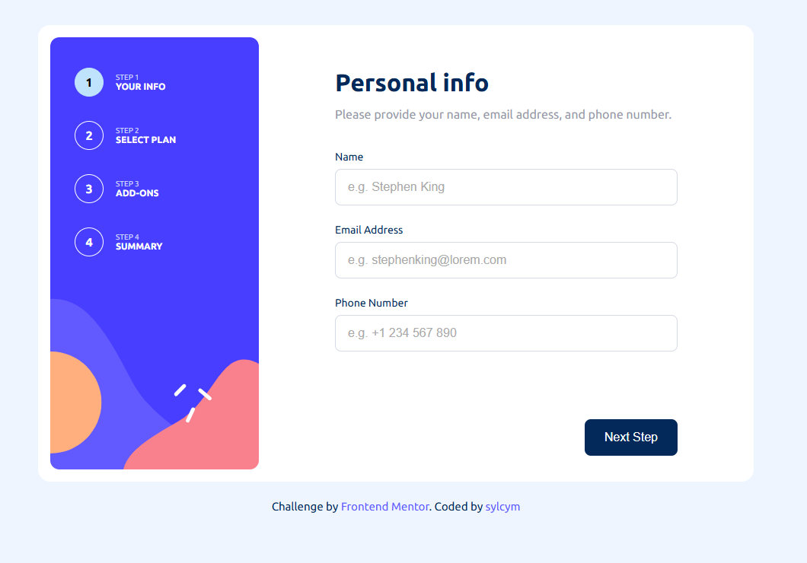

# Multi Step Form

A responsive multi-step form built with React and CSS as part of a Frontend Mentor challenge.

## Overview

This project is a fully responsive multi-step subscription form that allows users to:

- enter personal information,
- choose a subscription plan,
- select add-ons,
- review a summary,
- confirm their subscription.

The application includes validation, dynamic pricing, responsive layouts, and a final thank-you state.

---

## Built With

- React
- Vite
- JavaScript
- CSS
- Flexbox
- Mobile-first workflow

---

## Features

- Responsive mobile and desktop layouts
- Multi-step navigation
- Form validation
- Dynamic monthly/yearly pricing
- Add-ons selection
- Interactive toggle switch
- Summary calculation
- Thank you confirmation screen
- Hover and focus states

---

## Screenshots

### Desktop



---

## Getting Started

### Installation

Clone the repository:

```bash
git clone https://github.com/your-username/multi-step-form.git
```

Navigate to the project folder:

```bash
cd multi-step-form
```

Install dependencies:

```bash
npm install
```

Start the development server:

```bash
npm run dev
```

---

## Folder Structure

```txt
src/
├── assets/
├── components/
│   ├── form/
│   ├── layout/
│   └── ui/
├── styles/
├── App.jsx
└── main.jsx
```

---

## What I Learned

During this project I practiced:

- React state management
- Controlled inputs
- Conditional rendering
- Dynamic UI updates
- Responsive design
- Component structure
- CSS organization
- Form validation logic

---

## Future Improvements

- Better accessibility support
- Animations between steps
- Local storage persistence
- Dark mode version

---

## Author

Frontend Mentor challenge completed by [Sylwia].

- Frontend Mentor - https://www.frontendmentor.io/
- GitHub - https://github.com/sylcym/frontend-mentor-challenges/tree/main/multi-step-form
