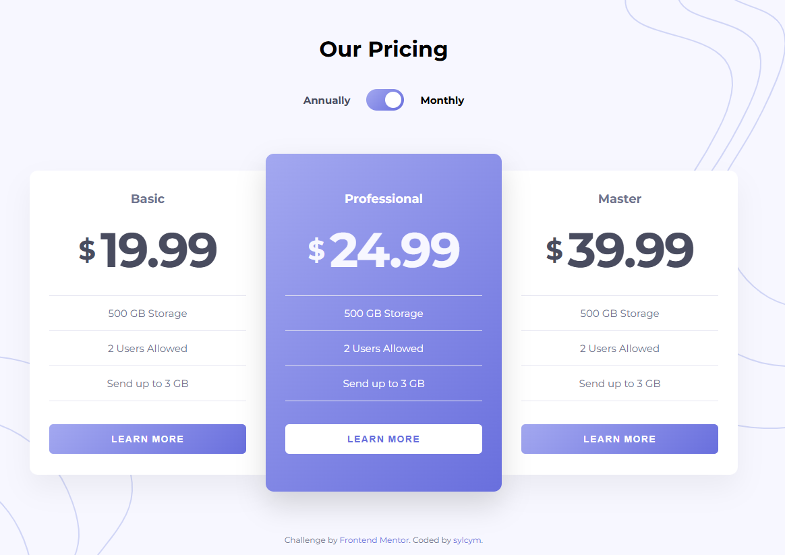

# Frontend Mentor - Pricing Component with Toggle Solution

This is my solution to the [Pricing Component with Toggle challenge on Frontend Mentor](https://www.frontendmentor.io/challenges/pricing-component-with-toggle-8vPwRMIC). The challenge focuses on building a responsive pricing component with interactive billing toggle functionality. :contentReference[oaicite:0]{index=0}

## 📸 Screenshot

!

---

## 🔗 Links

- Live Site: [Pricing Component Live Demo](https://sylcym-pricing-component.netlify.app/)
- Solution URL: [GitHub Repository](https://github.com/sylcym/frontend-mentor-challenges/tree/main/pricing-component?utm_source=chatgpt.com)
- Challenge: [Frontend Mentor Challenge](https://www.frontendmentor.io/challenges/pricing-component-with-toggle-8vPwRMIC?utm_source=chatgpt.com)

---

## 🛠 Built with

- Semantic HTML5
- CSS Modules
- Flexbox
- Mobile-first workflow
- React
- Vite 4
- JavaScript (ES6+)

---

## ✨ Features

- Responsive mobile-first layout
- Animated pricing toggle
- Dynamic monthly/yearly pricing
- Hover states and micro-interactions
- Desktop and mobile optimized layout
- SVG decorative background assets
- Clean component structure

---

## 🧠 What I learned

During this project I practiced:

- Building responsive layouts from Figma
- Managing component state with React
- Creating reusable UI components
- Working with CSS Modules
- Handling layout issues with Flexbox
- Implementing smooth UI animations and hover states
- Structuring Frontend Mentor projects professionally

I also learned how important it is to:

- adjust breakpoints based on the actual layout instead of fixed device sizes
- separate UI into smaller reusable components
- improve UX with subtle animations and transitions

## 👩‍💻 Author

- GitHub - [@sylcym](https://github.com/sylcym?utm_source=chatgpt.com)
- Frontend Mentor - [@sylcym](https://www.frontendmentor.io/profile/sylcym?utm_source=chatgpt.com)

---

## 🙌 Acknowledgments

Frontend Mentor challenges are a great way to practice real-world frontend development and improve responsive UI skills.
