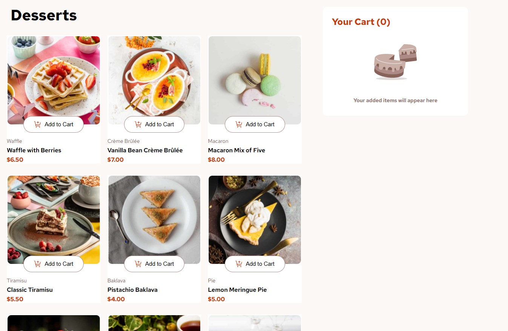

# Frontend Mentor - Product List with Cart

This is a solution to the Product List with Cart challenge on Frontend Mentor.

## Live Site

Live URL:

## Screenshot

## Overview

Users can:

- Add products to the cart
- Increase and decrease product quantity
- Remove items from the cart
- See the order total update dynamically
- Confirm the order in a modal window
- View responsive layouts for mobile, tablet, and desktop

## Built with

- React
- Vite
- CSS
- Flexbox
- CSS Grid

## Features

- Responsive product gallery
- Shopping cart functionality
- Order confirmation modal
- Accessible buttons with aria-labels
- Responsive images using the picture element

## What I learned

During this project I practiced:

- React state management with useState
- Conditional rendering
- Working with JSON data
- Responsive layouts
- Component structure
- Accessibility basics
- Using the picture element for responsive images

## Author

- Frontend Mentor - https://www.frontendmentor.io/profile/sylcym
- GitHub - https://github.com/sylcym
